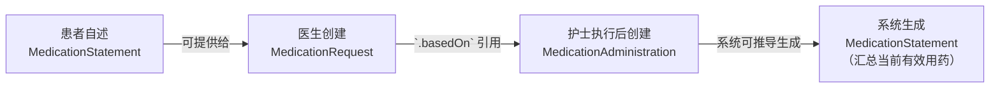

FHIR 中的“用药记录”并非一个单一概念，而是一个由不同角色、不同时间点和不同意图构成的连续工作流。

FHIR 中的药物相关记录类型本质上是是**状态机（State Machine）和责任链（Chain of Responsibility）**。每个资源代表业务流程中的一个特定状态（如“已下达”、“已执行”、“已陈述”），并通过引用链接形成完整的、可审计的责任链。以下是基于此原理的决策逻辑与实现方案。
### 核心逻辑：根据数据源的意图选择资源

用药信息的记录遵循“谁在什么时间点产生了什么信息”的原则。这直接对应到三个核心资源：

1.  **MedicationRequest（用药请求）**
    *   **意图与状态**：代表一个**临床意图**或**指令**。这是一个对未来行为的请求，其状态包括 `active`（激活）、`completed`（完成）、`cancelled`（取消）等。
    *   **数据来源**：由具有处方权的医疗专业人员（如医生）创建。
    *   **核心信息**：包含用药方案（药品、剂量、频次、途径）、用药原因、有效时间段、开立者、开立时间。
    *   **类比**：医院的“医嘱单”或药房的“处方”。

2.  **MedicationAdministration（用药管理）**
    *   **意图与状态**：代表一个**已发生的事实**。这是对MedicationRequest指令的一次具体执行事件的记录，状态为 `completed`。
    *   **数据来源**：由执行给药的医疗专业人员（如护士）在给药后记录。
    *   **核心信息**：包含实际使用的药品、实际剂量、实际给药时间、给药途径、执行者。它必须通过 `.basedOn` 字段引用一个或多个MedicationRequest，以建立从“指令”到“执行”的可追溯性。
    *   **类比**：护士的“给药记录”，精确到某年某月某日某时某分给患者注射了某药。

3.  **MedicationStatement（用药陈述）**
    *   **意图与状态**：代表一个**关于用药的断言或声明**。它描述的是患者**正在使用、曾经使用或计划使用**某种药物的状态，不一定关联到具体的医嘱。
    *   **数据来源**：可以来自患者自述（如“我每天吃一粒阿司匹林”）、家属转述，或由系统从历史记录中汇总生成。
    *   **核心信息**：包含陈述的用药信息、有效时间段、信息状态（如 `active`, `completed`）、信息来源（`patient-reported`）。
    *   **类比**：病历中的“现病史-用药史”部分，或患者填写的“用药清单”。

一个完整的院内用药闭环通常遵循以下可追溯的数据流：

这种设计确保了数据的**不可变性与可审计性**。每个事件（开立、执行）作为一个独立的资源被记录，通过引用链形成完整的溯源路径。

*   **追求完整审计溯源**：必须使用 `MedicationRequest` + `MedicationAdministration` 的组合。这引入了更高的系统复杂性，但提供了从医嘱到执行的全链路证据。
*   **记录患者用药史或社区医疗场景**：使用 `MedicationStatement` 更为合适和轻量。它牺牲了与具体执行事件的强关联，但能更灵活地捕获患者陈述或汇总的用药信息。
*   **一个常见错误**是试图用一个 `MedicationStatement` 来同时扮演“医嘱”和“执行记录”的角色。这会破坏数据模型，导致无法区分“医嘱内容”、“实际执行情况”和“患者陈述”，在出现用药差错时无法进行有效溯源。

### 示例：记录一次门诊处方及取药

1.  **医生开处方**：创建 `MedicationRequest`，状态为 `active`，包含药品、用法用量、开立时间。
2.  **药师发药**：（若需记录发药行为）可创建 `MedicationDispense` 资源（另一个相关资源），记录发药时间、数量，并通过 `.basedOn` 引用上述 `MedicationRequest`。
3.  **患者回家服药**：此事件通常不在临床系统直接记录。但患者复诊时，可自述“我按处方吃了药”，此时可创建一条来源为 `patient-reported` 的 `MedicationStatement`，通过 `.derivedFrom` 关联到最初的 `MedicationRequest`，表明此陈述源于该处方。

