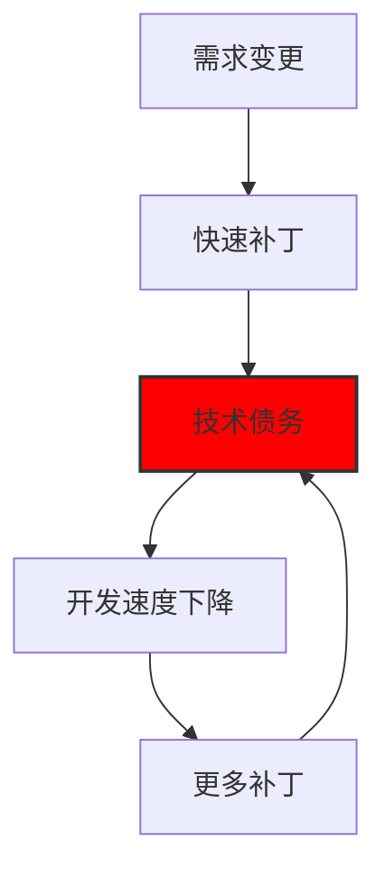
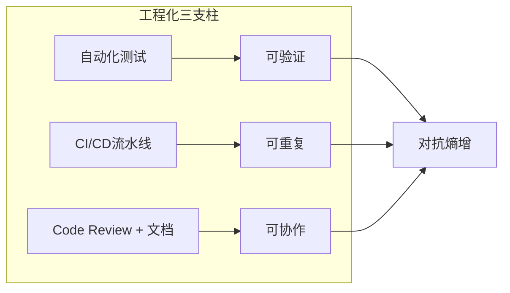

> 在有限认知下，持续对抗系统熵增，在相互冲突的目标间做出最优权衡，以可工程化的方式交付价值。

一、复杂性是固有属性，而非偶然缺陷

软件复杂性源于**状态空间的指数级爆炸**。一个仅有100个布尔变量的系统，其状态空间已达 $2^{100}$（约 $10^{30}$），远超人类认知极限。

```python
# 示例：复杂度不在于代码行数，而在于状态组合
class Order:
    def __init__(self):
        self.paid = False          # 2^1
        self.shipped = False       # 2^2
        self.cancelled = False     # 2^3
        # 3个布尔值 -> 8种合法状态，但业务规则会禁止某些组合
        # 真实系统有上千个状态变量 -> 灾难
```

复杂性是软件的本质，无法消除，只能转移或控制。这与建筑工程有本质区别，桥梁不会自发产生新状态。

二、 熵增是不可逆热力学过程

组织沟通结构的混乱会精确映射为代码结构的混乱。代码在没有外力干预下必然走向腐烂。



技术债务的利息是**超线性**增长的。一个类被10个模块依赖时，修改它的成本不是10倍，而是约 $O(n^2)$ 倍，因为需要理解所有依赖方的上下文。

三、人类认知约束

人类工作记忆容量为 $7 \pm 2$ 个信息单元。这是代码审查、架构设计、故障排查的硬性天花板。

- **微观影响**：函数参数超过5个，Bug率指数上升（认知过载）
- **宏观影响**：微服务拆分粒度需匹配团队规模（2个披萨团队原则）

**工程化手段**：通过**抽象**和**封装**将信息压缩到认知边界内。

```java
// 坏：每次调用需理解10个参数
void processOrder(int userId, int productId, String addr, ... ) // 8+参数

// 好：将认知负荷压缩到1个概念
orderProcessor.handle(new OrderContext(...)); // 单一职责
```

四、权衡是唯一的决策动作

不存在"最佳实践"，只存在"在特定约束下的最优权衡"。

| 维度 | 方案A | 方案B | 权衡代价 |
| :--- | :--- | :--- | :--- |
| **一致性** | 强一致 (分布式锁) | 最终一致 (事件驱动) | 可用性↓ vs 延迟↓ |
| **性能** | 缓存热点数据 | 实时查询DB | 一致性风险 vs 成本↑ |
| **交付** | 重构老系统 | 增量迁移 | 短期风险 vs 长期成本 |
| **灵活性** | 抽象接口 | 硬编码 | 复杂度↑ vs 开发速度↑ |

**决策框架**：每次技术选型必须回答：
1. 优化了什么指标？（延迟、吞吐、正确性）
2. 牺牲了什么？（成本、一致性、简单性）
3. 牺牲是否可接受？（业务是否允许P99.9延迟上升50ms？）

五、工程化 = 可重复 + 可验证 + 可协作

代码本身是廉价的，**可维护、可演进的系统**才是工程目标。



**关键指标**：
- **MTTR**（平均修复时间） < **MTBF**（平均故障间隔）是伪命题。真实目标是：**MTTR 必须小于业务容忍的极限**。
- **Bus Factor**：核心模块的 Bus Factor=1 时，系统已处于高风险状态，与人无关，是工程化失败。

---

自然界趋向无序，软件工程通过持续注入**负熵**（规范、测试、重构）维持秩序。

在认知约束下，通过严格的工程纪律，将不可控的复杂性转化为可控的复杂性，并在永恒的权衡中追求局部最优解。

没有银弹，只有**在正确的时间，为正确的目标，做出正确的权衡，并准备好为选择付出代价**。

